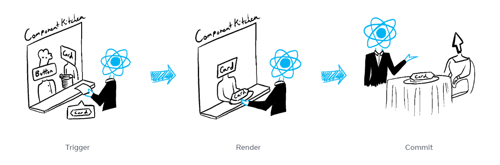

> 이번 파트에서 배울 내용
> - 리액트에서 렌더링의 의미  
> - 리액트가 컴포넌트를 언제, 왜 렌더링하는지  
> - 화면에 컴포넌트를 표시하는 단계  
> - 렌더링이 항상 DOM 업데이트를 하지 않는 이유  

## 렌더링 단계
  

리액트에서 렌더링은 크게 3가지의 단계를 통해서 진행됩니다.  

1. 렌더링 **트리거**  
2. 컴포넌트 **렌더링**  
3. DOM에 **반영**  

### 1. 렌더링 트리거
컴포넌트 렌더링을 트리거하는 이유는 두 가지 입니다.  

1. 컴포넌트의 초기 렌더링  
2. 컴포넌트의 state가 업데이트된 경우  

### 2. 컴포넌트 렌더링
렌더링을 트리거하면 React가 컴포넌트를 호출하여 화면에 표시할 내용을 파악합니다.  
즉, 렌더링이란 React가 컴포넌트를 호출하는 것입니다.  

- 초기 렌더링인 경우: React가 루트 컴포넌트를 호출  
- 이후 렌더링인 경우: React가 state의 업데이트가 발생한 컴포넌트를 호출  

### 3. DOM 업데이트
React는 이전 컴포넌트 렌더링 결과와 현재 컴포넌트 렌더링 결과를 비교하여 차이가 있는 경우에만 DOM 노드를 변경합니다.  

- 초기 렌더링인 경우: React가 `appendChild()` 를 사용하여 모든 DOM 노드를 화면에 표시  
- 이후 렌더링인 경우: React가 필요한 최소한의 작업만 사용하여 DOM 노드 업데이트  
