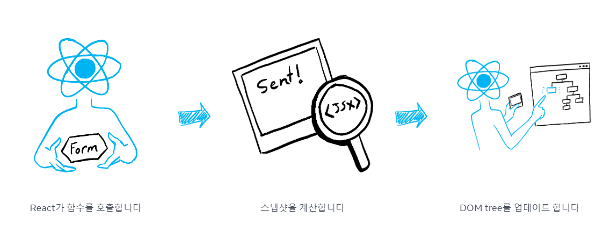

> 이번 파트에서 배울 내용
> - 상태의 변화가 리렌더링을 발생시키는 방법  
> - 상태를 언제 어떻게 업데이트하는지  
> - 왜 상태 변경이 일어났다고 즉시 상태를 변경하지 않는지  
> - 이벤트 핸들러가 상태의 `snapshot` 에 접근하는 방법  

## state를 변경하면 렌더링이 동작합니다
```jsx
import { useState } from 'react';

export default function Form() {
  const [isSent, setIsSent] = useState(false);
  const [message, setMessage] = useState('Hi!');
  if (isSent) {
    return <h1>Your message is on its way!</h1>
  }
  return (
    <form onSubmit={(e) => {
      e.preventDefault();
      setIsSent(true);
      sendMessage(message);
    }}>
      <textarea
        placeholder="Message"
        value={message}
        onChange={e => setMessage(e.target.value)}
      />
      <button type="submit">Send</button>
    </form>
  );
}

function sendMessage(message) {
  // ...
}
```

## 렌더링은 그 시점의 스냅샷을 찍습니다.
  

렌더링이란 React가 컴포넌트, 즉 함수를 호출한다는 뜻입니다.  
그런데 컴포넌트는 `JSX` 를 반환하게 되는데, 이 말은 즉 특정 시점에서의 화면 정보를 갖고 있는 스냅샷을 반환한다는 이야기가 됩니다.  

### 주의사항
```jsx
import { useState } from 'react';

export default function Counter() {
  const [number, setNumber] = useState(0);

  return (
    <>
      <h1>{number}</h1>
      <button onClick={() => {
        setNumber(number + 1);
        setNumber(number + 1);
        setNumber(number + 1);
      }}>+3</button>
    </>
  )
}
```

특정 시점에서의 모든 상태는 동일한 값을 가지고 있기 때문에 위와 같이 `setNumber(number + 1)` 을 호출한다고 해서 값이 3번 증가하는 것이 아니라, `setNumber(2 + 1)` 을 3번 호출하는 결과와 같게 됩니다.  

이는 비동기적인 처리를 해도 마찬가지입니다.  

```jsx
import { useState } from 'react';

export default function Counter() {
  const [number, setNumber] = useState(0);

  return (
    <>
      <h1>{number}</h1>
      <button onClick={() => {
        setNumber(number + 5);
        setTimeout(() => {
          alert(number);
        }, 3000);
      }}>+5</button>
    </>
  )
}
```

버튼을 클릭하면 증가된 값이 아니라 이전 스냅샷의 값 `0` 이 그대로 출력됩니다.  
**state 변수**의 값은 이벤트 핸들러의 코드가 비동기적이더라도 **렌더링 내에서 절대 변경되지 않습니다.**  
