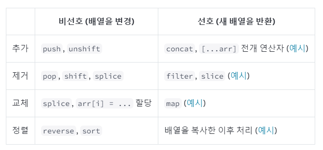

> 이번 파트에서 배울 내용
> - 리액트의 상태에서 배열을 다루는 방법    
> - 배열 내부의 객체를 변경하는 방법  
> - Immer로 덜 반복해서 배열을 복사하는 방법  

## 변경하지 않고 배열 업데이트하기  
객체를 상태로 다룰 때에도 읽기 전용인 것처럼 다뤄야 했듯 배열 또한 읽기 전용처럼 다뤄야 합니다.  
따라서 원본 배열을 변경하지 않은 채 새로운 배열을 만들어서 불변성을 유지한 채 상태를 변경해야 합니다.  

  