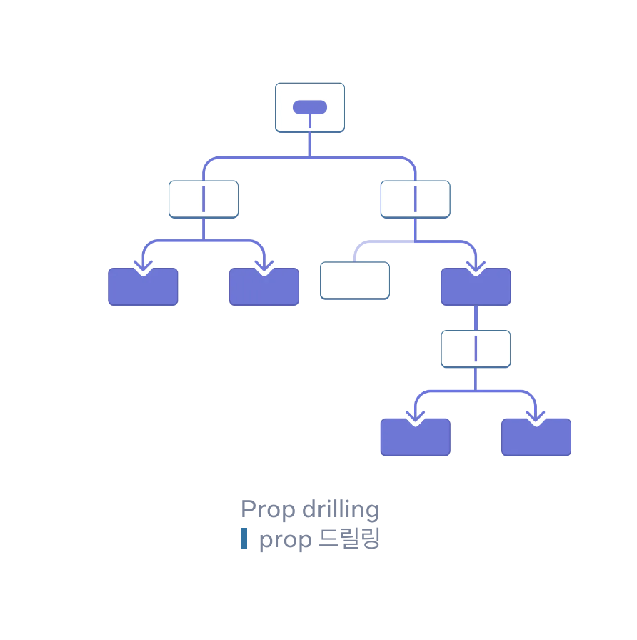

# context로 데이터 깊숙이 전달하기

> - Context를 사용하면 부모 컴포넌트가 props를 통해 명시적으로 전달하지 않고도 깊이 여부와 무관하게 그 아래 트리의 모든 컴포넌트에서 일부 정보를 사용할 수 있다.

## Props 전달의 문제

- 트리 깊숙이 prop을 전달해야 하거나 많은 컴포넌트에 동일한 prop이 필요한 경우 prop 전달이 불편해질 수 있다. `prop drilling` 발생 <br>

  

- context를 사용하면 상위 컴포넌트가 그 아래 전체 트리에 데이터를 제공할 수 있다.

1. context 생성하기
   - createContext()로 context를 생성한다.
   - createContext의 유일한 인수는 기본값이다.
   - 컴포넌트에서 사용할 수 있도록 파일에서 내보내기를 해야 한다. (export default)
     ```js
     import { createContext } from "react";
     export default LevelContext = createContext(1);
     ```
2. 데이터가 필요한 컴포넌트에서 해당 context를 사용한다. (자식)
   - useContext Hook을 가져온다.
     ```jsx
     import { useContext } from "react";
     ```
   - 자식 컴포넌트에서 context를 사용한다.
     ```jsx
     function childComponent() {
       const level = useContext(LevelContext);
     }
     ```
3. 데이터를 지정하는 컴포넌트에서 해당 context를 제공한다. (부모)
   - contextProvider로 감싸 context를 제공한다.
   ```jsx
   <Parent>
     <LevelContext.Provider value={level}>{children}</LevelContext.Provider>
   </Parent>
   ```
