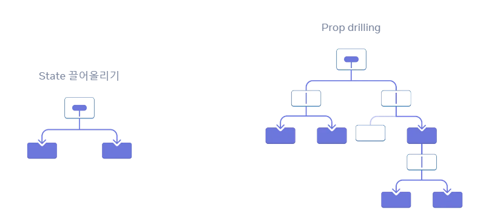
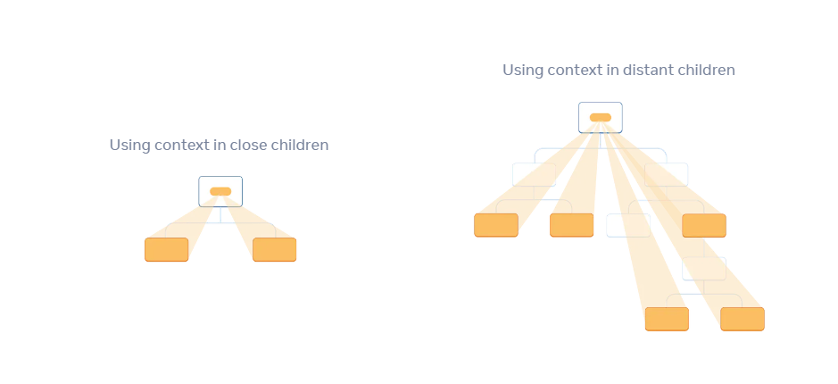

> 이번 파트에서 배울 내용
> - `prop drilling` 이란?  
> - 반복적인 prop 전달을 context를 통해 대체하는 방법  
> - context의 일반적인 사용 사례  
> - context의 일반적인 대안  

## Props 전달하기의 문제점
상위 컴포넌트에서 하위 컴포넌트로 Props 를 전달하는 방법은 UI 트리를 통해 명시적으로 데이터를 사용하는 훌륭한 방법이지만, 공통으로 사용되는 Props를 반복적으로 내려주는 것은 깊이가 깊어질 수록 비효율적일 수 있습니다.  



## Context
Context 는 Props 전달하기의 대안으로 사용할 수 있는 방법입니다.  
이를 사용하는 방법은 크게 3단계입니다.  



### 1. Context 생성
컨텍스트를 생성하고 외부에서 사용할 수 있도록 내보냅니다.  
생성된 컨텍스트 내부에는 `Provider` 와 `Consumer` 가 존재합니다.  

```js
import { createContext } from 'react';

export const LevelContext = createContext(1);
```

### 2. Context 제공
상위 컴포넌트에서 컨텍스트의 `Provider` 로 모든 하위 컴포넌트를 감싸서 공유해서 사용할 수 있는 값을 전달합니다.  

```jsx
import { LevelContext } from './LevelContext.js';

export default function Section({ level, children }) {
  return (
    <section className="section">
      <LevelContext.Provider value={level}>
        {children}
      </LevelContext.Provider>
    </section>
  );
}
```

### 3. Context 사용
하위 컴포넌트에서 `useContext()` 훅을 통해 데이터를 가져옵니다.  

```jsx
import { useContext } from 'react';
import { LevelContext } from './LevelContext.js';

export default function Heading({ children }) {
  const level = useContext(LevelContext);
  
  // ...
}
```

## Context를 사용하기 전에 고려할 것
Context는 데이터를 전달하고 가져와서 사용하기에 굉장히 편리한 방법이기 때문에 남용하기 쉽지만, 먼저 고려해야 할 점이 있습니다.

- **Props 전달하기 방식을 우선적으로 사용하기**  
사소한 컴포넌트들이 아니라면 여러 개의 props가 여러 컴포넌트를 거쳐 가는 가는 것은 그리 이상한 일이 아닙니다. 힘든 일처럼 느껴질 수 있지만 어떤 컴포넌트가 어떤 데이터를 사용하는지 매우 명확히 해줍니다. 데이터의 흐름이 props를 통해 분명해져 코드를 유지보수 하기에도 좋습니다.  
- **컴포넌트를 추출하고 JSX를 `children` 으로 전달하기**  
단순히 데이터를 사용하지 않는 중간 컴포넌트의 `props drilling` 현상을 스킵하기 위한 용도라면, 컴포넌트 자체를 추출해서 사용하는 방법이 더 유용할 수 있습니다.  
예를 들어:

```jsx
<Layout posts={posts} /> // 이런 방법 대신에
<Layout><Posts posts={posts} /><Layout> // 이런 방법 사용
```
